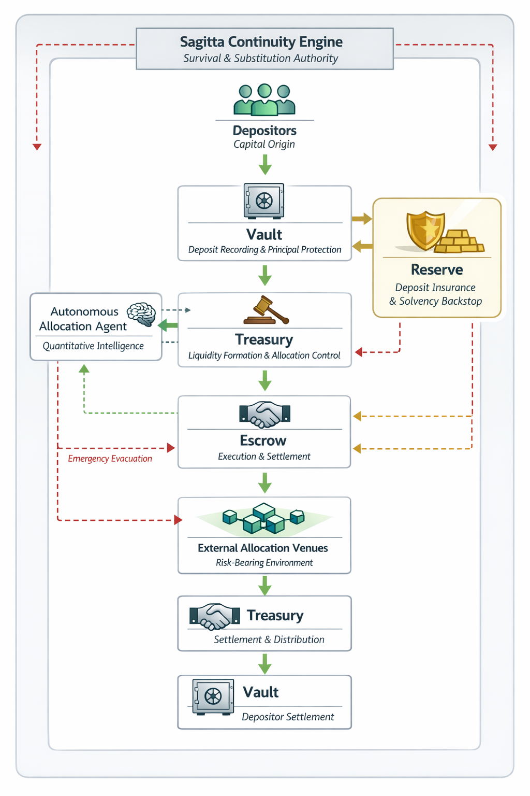

# Capital Flow Diagram

### Diagram Purpose

The Capital Flow Diagram illustrates **how capital enters, moves through, and exits the Sagitta Protocol**, and which authority governs each stage.

The diagram emphasizes:

* separation of roles
* deterministic settlement
* insurance enforcement
* continuity supremacy

This diagram represents **lawful flow**, not optimization paths.

***

<figure><figcaption></figcaption></figure>
